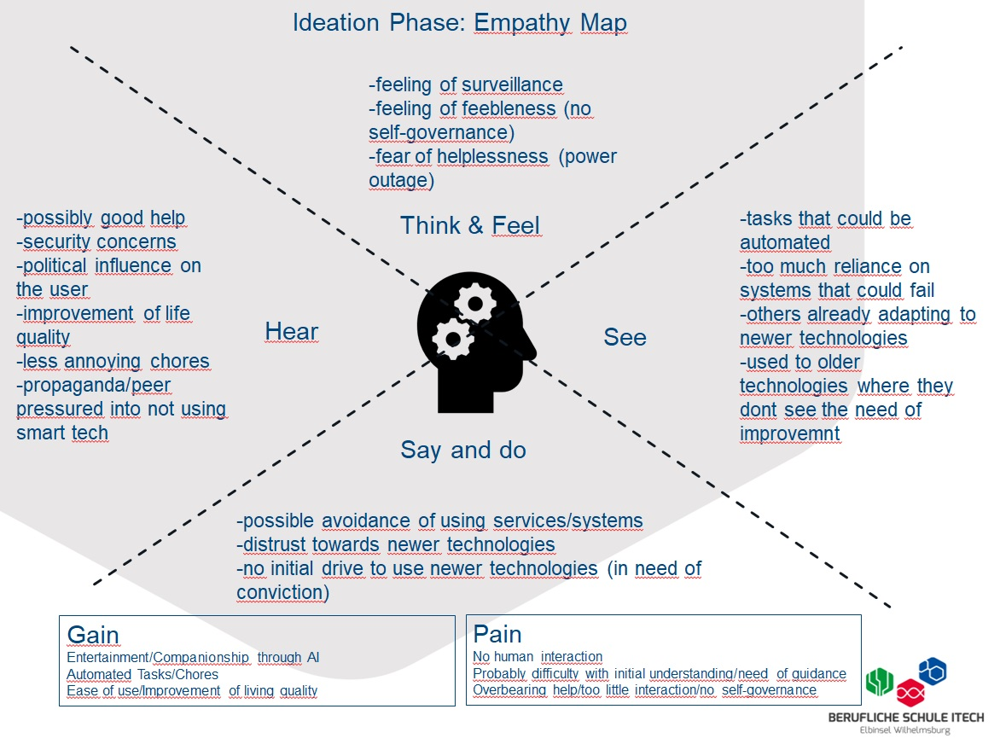
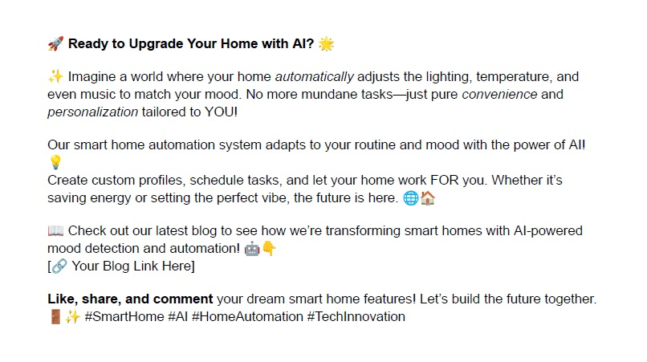

# Portfolio for LF7 - Hackathon

 By Lucas Witt, Mats Granel & Christian Radke 

---

## 1. Individual learning goals
Since most problems occure automatically by themselves we would like to focus more and learning how to ideate possible solutions and approach them afterwards. Therefore we would also like to learn how to setup and use a Raspberry Pi in combination with smaller modules e.g. like sensors for touch or light.

 

## 2. DIY problem definition (5WH)

### 2.1. What is the key issue you are trying to address and why is it important?

The key issue being addressed is the lack of a seamless, adaptive, and truly personalized
smart home experience. While current systems allow automation, they typically rely on static
schedules or simple triggers, requiring significant user input. This product aims to introduce
AI-driven automation that can intelligently adjust tasks based on users’ moods, behaviors,
and preferences, offering a more intuitive and user-friendly home experience.
This is important because modern lifestyles demand convenience and efficiency. As people
spend more time at home and technology becomes more integrated into daily life, there’s a
need for smarter, more responsive systems that do not require constant manual
adjustments. Enhancing the smart home experience can improve comfort, security, and
energy efficiency.

### 2.2. Who is it a problem for?

This is a problem for individuals and families who use or are interested in using smart home
devices but find current systems cumbersome or limited. This includes tech-savvy users who
crave deeper personalization and automation, as well as busy professionals, elderly people,
or those with accessibility needs who benefit from homes that can automatically adapt to
their routines.
It also impacts those who are environmentally conscious and looking to reduce energy
consumption without sacrificing comfort.

### 2.3. What social/cultural factors shape this problem?

The rising demand for convenience, personalization, and energy efficiency in homes shapes
this problem. With the growing adoption of smart home technology, there’s an expectation for
devices to be intuitive and tailored to individual lifestyles. Moreover, as work-from-home
setups become more common, the home environment plays a bigger role in productivity,
comfort, and well-being.
Additionally, concerns over privacy and data security influence how people interact with
smart home systems. Trust in AI handling personal data, including mood detection, is a
significant cultural factor, requiring transparent design to ensure user confidence.

### 2.4. What evidence do you have that this is worth the investment?

- **Market Growth:** The smart home automation market is booming. According to
research, the global smart home market is expected to reach $135.3 billion by 2025,
driven by increasing demand for convenience, security, and energy efficiency.
- **Consumer Trends:** Surveys show that consumers are looking for more personalized
and advanced automation systems that make their lives easier. AI-powered
personalization and automation are often listed as desirable features in smart homes.
- **Behavioral Evidence:** User data from existing smart home products indicates a
demand for systems that can automatically adjust based on habits and preferences,
suggesting that more sophisticated automation would attract a broader audience.

### 2.5. Can you think of this problem in a different way? Can you reframe it?

This problem can be reframed as one of anticipatory design rather than just automation.
Instead of thinking about smart homes that simply respond to commands, the focus could
shift toward homes that anticipate the user’s needs before they’re even aware of them. By
reframing the problem in terms of proactive and predictive living environments, it shifts from
reactive automation to creating a living space that truly enhances quality of life by
preemptively adapting to the user’s state and environment.

 

## 3. Emphatize and Define

### 3.1. Observation (AEIOU)

")

### 3.2. Empathy Map

 

## 4. Ideate

### 4.1. The Dreamer – Developing an Inspiring Vision

#### What do we really want?

We want a smart home product that simplifies everyday life by automating tasks and
routines, providing users with complete control over their environment. The goal is for users
to create customized profiles that can seamlessly adapt based on time, mood, and behavior,
ultimately offering an enhanced and personalized living experience.

#### How would an ideal solution look like?

An ideal solution would be a sleek, intuitive interface that integrates effortlessly with existing
smart home devices. Users can create, schedule, and modify automation profiles with ease.
The system would also have built-in AI that learns user preferences over time, adjusting
settings—such as lighting, temperature, and music—based on their mood or habits,
providing dynamic adjustments to daily routines.

#### What are the benefits of the solution?

- **Personalization:** 
Tailored experiences for each user based on mood and routine, increasing comfort and convenience.

- **Automation:**
Saves time by automating repetitive tasks like turning off lights, adjusting the thermostat, or scheduling coffee machines.

- **Seamless Integration:**
Works with a variety of smart home devices (thermostats, lights, entertainment systems, security) through an easy-to-use hub.

- **Adaptive AI:**
Anticipates user needs by learning from behavior, moods, and schedules.

- **Energy Efficiency:**
Optimizes smart home device usage, contributing to sustainability.

#### What if we had no monetary/time constraints?

We could develop cutting-edge AI that not only learns from patterns but also uses biometric
inputs like facial expressions or voice tone to detect the user’s emotional state. This would
allow the system to preemptively adjust the environment, offering suggestions for optimal
comfort. Advanced integration would allow it to work universally across all smart home
brands, further enhancing user experience. It might also feature VR or AR control for
immersive management of home automation.

#### What other crazy idea jumps in our mind?

The product could evolve to predict and suggest lifestyle improvements, such as
recommending health tips, adjusting environments for better sleep or productivity, or
suggesting social reminders like connecting with family or friends.

 

### 4.2. The Realist – Converting Ideas into an Action Plan

#### What do we need to implement the ideas?

- **Hardware/Software Development:**
A hub or cloud-based system that connects with various smart devices. AI for behavioral analysis and mood detection would require machine learning capabilities.

- **Partnerships:**
Collaborations with manufacturers of smart devices (lighting, thermostats, appliances, entertainment systems).

- **User Interface (UI/UX) Design:**
Intuitive and user-friendly interfaces for mobile and desktop apps.

- **Data Collection and Analysis Tools:**
AI needs reliable data on user behavior and preferences to improve performance.

#### What should be discussed and be done?

- Integration possibilities with existing smart home ecosystems (Google Home, Amazon Alexa, Apple HomeKit).

- AI ethics and privacy concerns since the system will handle personal user data.

- A framework for adaptive learning AI to fine-tune the user experience over time.

- Balancing ease of use with deep customization for advanced users.

#### What is the best sequence of action?

1. **Prototype the Core Features:**
Task automation and profile scheduling.

2. **Integrate Existing Smart Home Devices:**
Begin with the most common (lighting, temperature control, security).

3. **Develop AI Components:**
Start by incorporating basic behavior pattern recognition, expanding to mood detection later.

4. **User Testing:**
Launch a beta version to gather feedback and refine the experience.

5. **Expand and Scale:**
After refining the system, work on integrations with a wider array of devices and AI enhancements.

#### On what can we already build?

We can utilize existing AI technologies for behavior analysis, natural language processing for
commands, and smart device APIs for integration. Off-the-shelf solutions can serve as the
foundation for connectivity with home automation platforms.

#### How can we evaluate the idea?

- **User Feedback:**
Measure the convenience, ease of use, and satisfaction through surveys and testing.

- **Device Compatibility:**
Ensure smooth integration across a wide range of smart home devices.

- **AI Adaptiveness:**
Evaluate how well the system learns and adjusts based on real user behavior.

- **Energy and Efficiency Metrics:**
Track energy savings and improved lifestyle outcomes.

 

### 4.3. The Questioner – Evaluating and Challenging Ideas

#### What is really possible?

Implementing basic task automation and integration with major smart home platforms is
highly feasible. Creating adaptive AI that learns from user behavior and mood is possible but
will require longer development cycles and advanced machine learning models.

#### What is hampering us from doing it?

- **Privacy Concerns:**
Users may be uncomfortable with data collection related to mood and behavior, so building trust through transparency and strong data protection is crucial.

- **Device Fragmentation:**
Different smart home devices use varied protocols, making universal integration complex.

- **AI Accuracy:**
Mood detection is tricky and may not always align with user expectations, leading to frustration if the system misinterprets cues.

#### What is missing?

- **AI Maturity:**
We need advanced algorithms capable of accurately assessing moods and behaviors beyond basic patterns.

- **Regulation:**
There may be regulatory hurdles related to privacy, especially concerning biometric data.

- **Interoperability:**
Ensuring compatibility across all devices and platforms remains a challenge.

#### What are weak points, and how can we cope with them?

- **AI False Positives/Negatives:**
Moods are subjective, and incorrect predictions could irritate users. A simple override function would let users manually adjust settings when needed.

- **User Skepticism on Privacy:**
Address concerns by providing clear options to opt out of AI analysis and ensuring all data is encrypted and anonymized.

- **Complex Setup:**
If the system is too hard to configure, it may alienate users. We can counter this with a user-friendly setup wizard and pre-configured profiles for immediate use.

This process balances ambition with practicality, ensuring that the product can start strong with room for future enhancements.

 

## 5. Business canvas model

 

## 6. Go viral post

 

## 7. Technical solution (overview)

### 7.1. Activity-Diagram

### 7.2. Use-Case-Diagram

 
